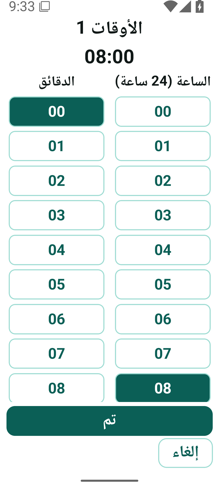
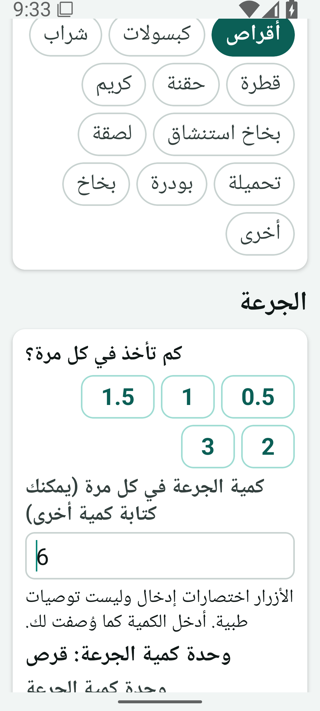
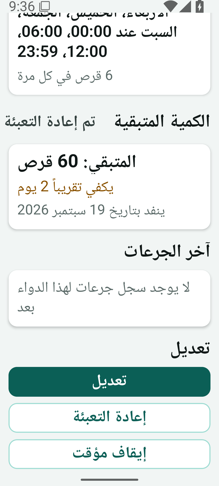
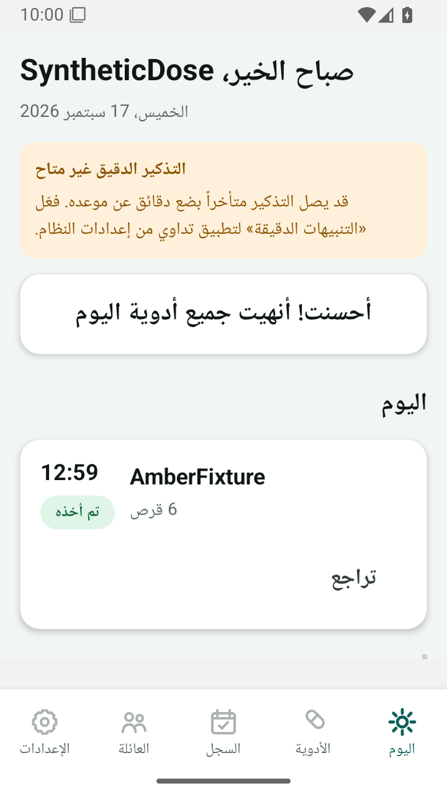
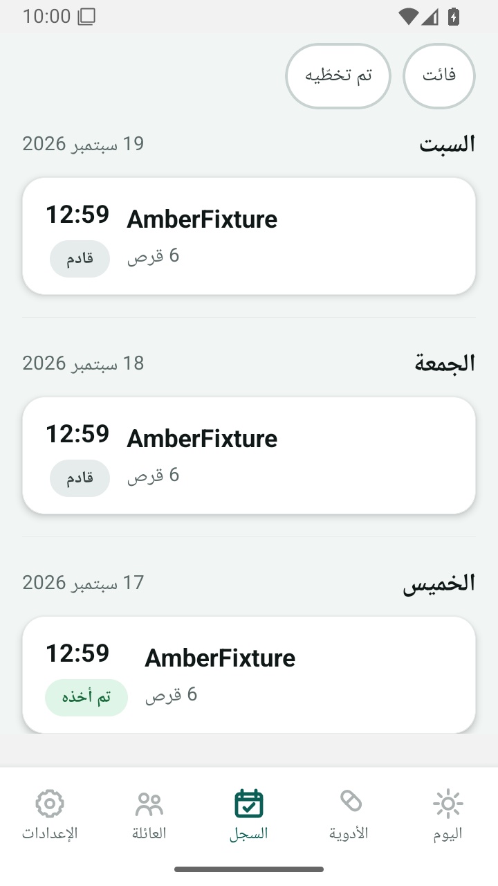

# متابعة الوصول واختبار Android — 17 سبتمبر 2026

## فتح المعاينة

- **PASS**: شاهد المتصفح صفحة استيقاظ Render ثم شاشة اللغة، وانتقل بالنقر إلى `/sign-in` ثم زر «نسيت كلمة المرور؟» إلى `/forgot-password`.
- سجل Render: بدء الخدمة 08:07:19 UTC، تحقق 85 ترحيلًا 08:07:29، بدء العامل بمزود Push اختباري، ثم استماع API في08:07:35. `GET /version` يطابق `0de543b54613757a116596fcb9e52d549c2f23ae`، و`/health/ready` جاهز في08:08:17 UTC.
- الخطة الفعلية `free`؛ استيقاظها بعد الخمول يجعل أول زيارة بطيئة. لم نغيّر الفوترة أو نضف طلبات دورية لإبقائها مستيقظة. لا يمكن لملف APK العمل على iOS؛ الويب هو مسار العرض المتاح على المتصفح.
- **BLOCKED**: صفحة الاستعادة على الويب تعرض عدم تهيئة التحقق؛ لم ترسل SMS ولم تُظهر نجاحًا وهميًا. ظهور الزر وحده لا يثبت اكتمال استعادة الحساب.

## الاختبار الجديد

`.github/workflows/android-interaction.yml` يبني حزمة `app.dawaee.audit` بمعماريةx86_64 ويشغل Android35 من صور Google الرسمية على محاكي مؤقت في GitHub. السكربت `scripts/android-interaction/check.py` يستخدم لمس ADB وإجراءات لوحة المفاتيح وقراءة شجرة إمكانية الوصول. لا يحقن state ولا يتخطى المصادقة ولا يستخدم لقطات مولدة.

حساب جديد اصطناعي في كل حالة، API المعاينة محدد في السكربت مع شرط تطابق commit قبل الكتابة. لا بيانات صحية حقيقية ولا حسابات إنتاج. كلمة الاختبار ورموز الجلسة في الذاكرة ولا تدخل في الملفات أو السجل؛ يبدأ التصوير بعد الدخول. لا تسجيل لـlogcat. تبقى بيانات الاختبار في قاعدة المعاينة، ولا ينفّذ السكربت حذفًا لحسابات الخادم.

| الحالة | حجم dp تقريبي | الخط | ما يُختبر | النتيجة قبل التشغيل |
| --- | --- | --- | --- | --- |
| small-ar | 360×640 |100%|الدخول، كمية6، فتح/رجوع3مرات، إلغاء، 23:59،4مواعيد، الحفظ مع مخزون60|NOT VERIFIED|
| large-ar-font200 |411×914|200%|نفس الرحلة؛ API يؤكد كمية6 ووحدةقرص و7أيام و4مواعيد|NOT VERIFIED|

النتائج الفعلية والـSHA وروابط التشغيل تثبت في PR#30. `results.json` والصور وMP4 تُرفع حتى عند فشل خطوة تفاعل. فشل البناء/إقلاع المحاكي لا يعد فشلًا مثبتًا في التطبيق، ونجاح تجميع APK لا يعد نجاح تفاعل. لا تعطيل لاختبارات CI السابقة.

**NOT VERIFIED** حتى بعد نجاح هذه الحالات: جهاز فعلي، إيماءة الرجوع، بقية إصداراتAndroid، الإشعارات الحقيقية وحالات القفل وإعادة تشغيل الجهاز، OCR بالمزود، SMS، جميع رحلات عدم الاتصال. النموذج يُختبر هنا بالأرقام الإنجليزية وواجهةعربية؛ حالات الأرقام العربية والكسور السابقة اختبارات إدخال آلية منفصلة.

متابعة إعداد المحاكي: الانتظار الأول لاتصالADB كان غير محدود؛ وُضع حد180ثانية للإقلاع و90ثانية للتثبيت و18دقيقة لمرحلةالتفاعل، مع فحص خروج عمليةالمحاكي وسجلإقلاع وAPK x86_64 تشخيصي. تُظهر لوحةالمفاتيح الافتراضية رغم وجود لوحة المضيف؛ ويُمنح إذن التنبيهات في الجهاز المؤقت لعزل نوافذ أذونات النظام عن اختبار النموذج. هذا لا يختبر منح الإذن من واجهة Android ولا وصول Push.

مرجع تشغيل المحاكي: [Android command-line emulator](https://developer.android.com/studio/run/emulator-commandline). الأدلة تخص المحاكي والنسختين المسجلتين فيartifact، ولا تثبت جاهزيةالمتجر أو الإنتاج.

فشل إعداد التشغيل الأول `35198750709` قبل تنفيذ التفاعل: سجل المحاكي يذكر `Unknown AVD name [tadawee_audit]` وعدم وجود ملف تعريفه في مسار البحث. نجاح أمر إنشاء الجهاز لم يثبت أن المحاكي يستطيع إيجاده. التصحيح يحدد `ANDROID_AVD_HOME` ومسار الجهاز صراحةً، ويحفظ المتغير للخطوة التالية، ثم يتحقق من ملف التعريف وظهور الجهاز في `emulator -list-avds` قبل الإقلاع. نتيجة التطبيق في ذلك التشغيل **NOT VERIFIED**، وخلل تجهيز المحاكي **FAIL** حتى اجتياز إعادة التشغيل. مرجع اختلاف مسارات الأدوات: [Android environment variables](https://developer.android.com/tools/variables).

## أول تفاعل موثّق — 39ccc1e

[التشغيل 35200900770](https://github.com/NAIFMUSFER/dawaee/actions/runs/35200900770)، artifact `10488905072`، Android35 على 360×640dp وخط100%، العربية. كود التطبيق والخادم مطابق لـ0de543b؛ تغييرات39ccc1e خاصة بالاختبار والتوثيق.

- **PASS**: إنشاء المحاكي وإقلاعه وتثبيت الحزمة والدخول من الواجهة. ثلاثة تكرارات Back مع إلغاء تحافظ على08:00؛ تمرير عمودَي الوقت والوصول إلى23:59، وإضافة أربعة أوقات مستقلة، والوصول إلى زر الحفظ وحفظ دواء واحد.
- **FAIL — إدخال الاختبار**: لقطة `small-ar-quantity.png` وشجرتها تسجلان61 قبل الحفظ، و`small-ar-saved.png` يعرض61 قرصًا ومخزون60 وأربعة مواعيد وسبعة أيام. السكربت افترض أنEnd يضع المؤشر بعد القيمة الافتراضية1؛ لم يمسحها ثم أدخل6 قبلها. فشل شرط الحفظ الصحيح الذي يتوقع6. لم نغيّر شرط القبول ليقبل61 ولم نغيّر التطبيق لإخفاء الفشل.
- الإصلاح يستخدم حذفًا في اتجاهَي المؤشر، ثم يؤكد فراغ حقل الجرعة وظهور6 قبل المتابعة. يحفظ مقارنة API خالية من المعرّفات والرموز، ويجرب الحالتين المستقلتين حتى عند فشل إحداهما مع إبقاء التشغيل فاشلًا عند أي فشل.
- `small-ar-picker-open.png` التقطت مبكرًا أثناء انتقال النافذة وتعرض النموذج؛ ليست دليلًا على تصميم نافذة الوقت. التسجيل `small-ar-interaction.mp4` يُظهر التفاعل الفعلي. أُضيف انتظار ظهور«تم» قبل لقطة النافذة.
- **NOT VERIFIED**: حفظ6 من الواجهة حتى إعادة التشغيل؛ حالة الخط200% لم تُنفّذ بعد فشل الحالة الأولى. نتائج CI/security/native/APK على39ccc1e **PASS**؛ PostgreSQL16 و17 اجتازا2471 اختبارًا في331 ملفًا لكل منهما. هذا لا يحوّل نتيجة التفاعل الفاشلة إلىPASS.

## الخط الكبير وحفظ6 — a9ee7b0

[التشغيل 35202785236](https://github.com/NAIFMUSFER/dawaee/actions/runs/35202785236)، artifact `10488853163`:

- **PASS** لحالة `large-ar-font200`: Android35،1080×2400 بكسل بكثافة420 (نحو411×914dp)، العربية، تكبير200%. تكرارBack والإلغاء،23:59 وأربعة أوقات، ثم حفظ6 بوحدةtablet وسبعة أيام ومخزون60. الملف `large-ar-font200-persisted.json` يثبت القيم التي أعادها API؛ الصور وMP4 من التطبيق الفعلي.
- **FAIL — أدوات الاختبار** لحالة `small-ar`: خطأADB قبل الدخول؛ بقي فحص الكمية6 على الحجم الصغير **NOT VERIFIED** في هذا التشغيل. الرسالة القديمة حجبت اسم الأمر مع القيم، لذا السبب الدقيق **NOT VERIFIED**؛ لا ننسبه إلى التطبيق. لم يُعد إنشاء الحساب أو الحفظ تلقائيًا.
- المتابعة تستخدم نشاط التشغيل الذي يحدده Android مع انتظار `am start -W`، وتمنح قراءة شجرة الواجهة خمس محاولات محدودة عند انتقال النافذة. إعادة المحاولة تخص القراءة فقط؛ اللمس والتسجيل والحفظ لا يعاد إرسالها. أخطاءADB تذكر عائلة الأمر دون نص الإدخال أوstderr.
- CI/security/native/APK علىa9ee7b0 **PASS**؛ PostgreSQL16 و17:2471 اختبارًا/331 ملفًا لكل منهما. نتيجة التشغيل المركب تبقى **FAIL** رغم اجتياز الحالة الكبيرة.

## الحالتان مكتملتان — 159d62e

[التشغيل35204337212](https://github.com/NAIFMUSFER/dawaee/actions/runs/35204337212)، artifact10489947547: **PASS** لكل من360×640dp/100% و411×914dp/200% بالعربية، Android35. الدخول، الرجوع والإلغاء ثلاث مرات، تمرير23:59، أربعة مواعيد، حفظ6 أقراص وسبعة أيام ومخزون60 وقراءة القيم منAPI. الصور وMP4 وملفا`*-persisted.json` تثبت النتائج. CI/security/native/APK على159d62e **PASS** أيضًا. لا اختبار هاتف فعلي أو إيماءة رجوع؛ هذه متابعة لمصفوفة التدقيق الأولية وتحدّث حالتها السابقة.

القراءات الأصلية بلا معرّفات حسابات محفوظة في [evidence/159d62e](evidence/159d62e/)، مع commit التطبيق والخادم وبصمة المحاكي والحزمة. ملف MP4 يبدأ بعد فحوص Back والإلغاء ويغطي اختيار الأوقات والحفظ؛ فحوص Back موثّقة في السكربت وسجل التنفيذ و`results.json`، فلا يُنسب تصويرها إلى هذا المقطع.

## عنوان المعاينة

فحص المتصفح في17سبتمبر كشف أن عنوان التبويب ما زال «دوائي Dawaee» رغم أن التطبيق يعرض تداوي. المصدر `scripts/inline-web.py` كان يثبت الاسم القديم في `<title>` واسم الاختصار على الشاشة الرئيسية؛ صُحّح الاثنان إلى «تداوي | TADAWEE». التوليد المحلي باستخدام fixture البناء القائمة **PASS**، مع بقاء تجزئة CSP وحارسي origin صحيحين. هذا إصلاح في فرع المراجعة؛ المعاينة0de543b ما زالت تستخدم عنوانها القديم حتى نشر تحديثها، ولا تتغير به حزمة Android.

## تأكيد الجرعة والتراجع وإعادة الفتح — f8513aa

[التشغيل35206456235](https://github.com/NAIFMUSFER/dawaee/actions/runs/35206456235)، artifact10490557734، اكتمل17سبتمبر10:02UTC: **PASS**. SHA256 للأرشيف الأصلي `5585690cce8b7a8310bfb395d5d40fb60f7095c98892e4295fad8e317639b982`؛ النسخة0de543b من API والعامل، والتطبيقf8513aa (لم يتغير كود التطبيق/API بينهما؛ تغييرات اختبار وتوثيق).

`dose_check.py` أنشأ حسابين ودواءً اصطناعيًا مستحقًا حسب ساعة الخادم، مع المخزون وبدونه. التأكيد والتراجع والتأكيد الثاني تمّت بأزرار Android حصريًا؛ API جهز البيانات وقرأ الحالة والمخزون فقط. أُغلقت عملية التطبيق وفتحت ثانية ثم فُتح السجل.

| الحالة | القراءة المحفوظة | النتيجة |
| --- | --- | --- |
| دواء مع المخزون | taken/54 → pending_confirmation/60 → taken/54 → إعادة فتح: taken/54؛ حركات-6,+6,-6 بالضبط | PASS |
| دواء بلا مخزون | taken → pending_confirmation → taken → إعادة فتح: taken؛stock=null ولا حركات مخزون | PASS |
| بطاقة اليوم والسجل بعد إعادة الفتح | اسم الدواء الاصطناعي نفسه وحالة«تم أخذه» في شجرة الواجهة والصورة | PASS |
| إدخال الدواء بحجمين | أُعيدت الحالتان100%/200%، كمية6 وأربعة مواعيد و7أيام ومخزون60 | PASS |
| CI علىf8513aa | PostgreSQL16 و17:2471اختبارًا/331ملفًا لكل منهما؛security/native/APK/docker/recovery | PASS |

القراءات الأصلية وبصمات النسخ في [evidence/f8513aa](evidence/f8513aa/)، خالية من رموز الجلسة ومعرّفات الحسابات. تبقى حالات النقر المتزامن والانقطاع والتأكيد المتأخر والتخطي والتأجيل مغطاة باختبارات API/المكوّن السابقة؛ هذا التشغيل native لا يدّعي أنه ضغطها كلها. الهاتف الفعلي وإيماءة الرجوع ووصول التنبيه الحقيقي وSMS وOCR الفعلي **NOT VERIFIED/BLOCKED** بحسب المصفوفة. تحذير«التذكير الدقيق غير متاح» ظاهر بالمحاكي؛ لم نمنح إذن التنبيهات الدقيقة أو نعتبر وصولها ناجحًا.

