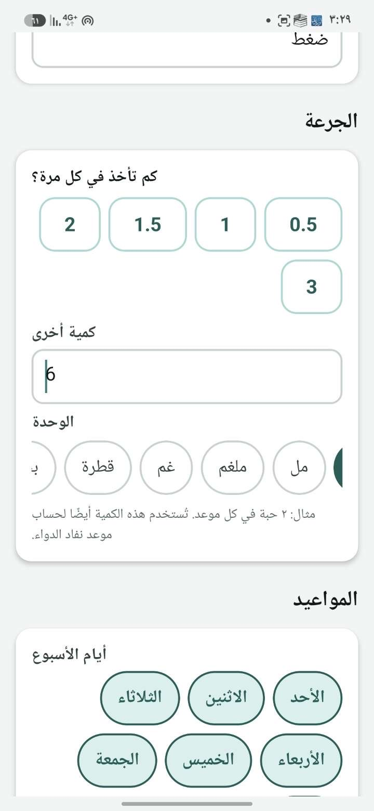

# مصفوفة التحقق — تداوي | TADAWEE

PASS هنا يخص نوع الدليل المذكور فقط. لا تعني اختبارات المكوّن اجتياز اختبار اللمس، ولا تعني استجابة Push وصول إشعار للهاتف. نتائج آخر commit وروابط تشغيله مثبتة في وصف PR #30 حتى لا ننسب تشغيلًا لنسخة مختلفة.

## الأجهزة والواجهة

| البيئة | الحجم / اللغة / الخط / الاتصال | المطلوب | النتيجة |
| --- | --- | --- | --- |
| Android صغير | 320×568 و 360×640 dp ، عربي RTL ، خط عادي/150%/200%، متصل/دون اتصال | النموذج كاملًا، لوحة مفاتيح مفتوحة/مغلقة، السبعة أيام، حفظ، تمرير الساعات والدقائق، Back فعلي وإيماءة | BLOCKED: لا جهاز أو محاكي متصل |
| Android كبير | 412×915 dp ، عربي/إنجليزي، أزرار تنقل/إيماءات | نفس الرحلة، فتح/إغلاق الوقت 10 مرات، تعديل/حذف/منع تكرار المواعيد | BLOCKED |
| Android خلفية/قفل/إعادة تشغيل | الرياض ثم منطقة أخرى، حسابان اختباريان | محلي و Push وقائمة التطبيق كل على حدة؛ إلغاء القديم بعد التعديل والتأكيد والخروج | NOT VERIFIED: تصريح المستخدم بوصول إشعار واحد لا يغطي هذه الحالات |
| Chrome / RN Web | ملف مقارنة مكوّنات قبل/بعد، 320×568 و 360×640 و 412×915 ؛ عربي/إنجليزي | تمرير ونقر وتكبير خط وصور بعد | BLOCKED: سياسة المتصفح رفضت loopback ثم file URL ؛ لم يُتجاوز المنع |
| Node 22.22.2 / screen harness | إدخال عربي/فارسي/إنجليزي، 6 ، 1/2 ، قيم غير صالحة، مواعيد 4 و 12 | حالة الشاشة والـ payload وإعادة المحاولة؛ لا تخطيط native | PASS آليًا؛ 1123 اختبارًا محليًا في 145 ملفًا مع اختبارات OCR المحددة |
| GitHub Actions / PostgreSQL 16 و 17 | مالك ترحيل غير superuser وغير BYPASSRLS ، بيانات تركيبية، مزودون اختباريون | SQL و RLS ومعاملات وتزامن/إعادة إرسال | PASS على b965a8e: 2396 اختبارًا في 320 ملفًا؛ إعادة الاختبار على آخر HEAD مثبتة في PR |
| Android native CI | arm64-v8a ، API=`https://example.invalid` ، DEMO=0 | تجميع APK/AAB ، فحص manifest و DEX والصلاحيات | PASS على b965a8e ؛ ليس APK قبول متصلًا ولا ملف متجر موقّعًا، ولا اختبار جهاز |

لم أتحقق من أي رحلة على هاتف فعلي في هذه الجلسة. يلزم تسجيل commit و versionCode ونسخة Android وحجم dp و fontScale وطريقة التنقل ووقت الاختبار والمنطقة الزمنية في كل تجربة لاحقة.

## تغطية رحلات المشروع

هذه مراجعة لمسارات الكود وإعادة تشغيل الاختبارات القائمة وإضافة انحدارات للمشاكل المثبتة، وليست شهادة بأن كل تفاعل حقيقي اجتاز الاختبار. أسماء الاختبارات أدناه داخل `apps/api/test` أو `apps/mobile/test` إلا حيث يُذكر غير ذلك.

| الرحلة | ملفات/أدلة تمت مراجعتها | النتيجة الآلية / المتبقي |
| --- | --- | --- |
| التسجيل/الدخول/الخروج/الاستعادة وانتهاء الجلسة | `auth.test.ts`, `password-auth.test.ts`, `auth-session.test.ts`, `auth-serialization-deadlock.test.ts`, `auth-transition-lifecycle.test.ts` ؛ `api/client.ts` يدير refresh مرة واحدة وحدود تبديل الحساب | PASS في الحزمة؛ مقدم استعادة الحساب/OTP الفعلي NOT VERIFIED |
| الملف والتبديل والصلاحيات | `profile-screen-races.test.ts`, `profile-self-identity.test.ts`, `endpoint-authorization.test.ts`, `profile-identity-runtime-controls.test.ts` | PASS ؛ عرض الملف على الجهاز NOT VERIFIED |
| إضافة الدواء/تعديل/إيقاف/أرشفة | `quick-create-final-audit.test.ts`, `medications.test.ts`, `medication-edit-metadata-roundtrip.test.ts`, `schedule-stop-resume-integrity.test.ts` | PASS ؛ التفاعل المرئي BLOCKED ؛ لا دواء يُنشأ في OCR قبل مراجعة المستخدم |
| الوقت/الكمية/الوحدات/أيام الأسبوع | `medication-input.test.ts`, `schedule-time-input-integrity.test.ts`, `time-field-final-audit.test.ts`, `stock-unit-integrity.test.ts` | PASS: فصل كمية الجرعة عن المواعيد، حد تقني 12 موعدًا فريدًا، كمية موجبة ≤1000 وحتى 4 منازل عشرية؛ كسر دوري كـ 1/3 يُرفض دون تقريب صامت |
| اليوم/التأكيد/السجل/المخزون | `final-audit-dose-stock.test.ts`, `today-final-audit.test.ts`, `stock-ledger-repeat-cycle.test.ts`, `dose-stale-replay-after-undo.test.ts`, `dose-early-action-integrity.test.ts`, `dose-snooze-state-integrity.test.ts` | PASS في الاختبارات المسجلة؛ إعادة فتح التطبيق على جهاز ونجاح الجرعة بالإنتاج NOT VERIFIED |
| التقارير | `report-permission-dependencies.test.ts`, `weekly-report-profile-timezone.test.ts`, `reports-hub-export-profile-race.test.ts`, `clinician-report-profile-race.test.ts` | PASS آليًا؛ فتح الملف المصدر على هاتف NOT VERIFIED |
| رفع الصورة/finalize/R2 | `upload-finalize-concurrency.test.ts`, `upload-finalized-ticket-replay.test.ts`, `upload-finalization-size-boundary.test.ts`, `s3-upload-content-type-binding.test.ts`, `storage-provider-security.test.ts` | PASS ببيانات اختبار؛ R2 فعلي مع صورة تركيبية جديدة NOT VERIFIED |
| الكاميرا/المعرض/الإلغاء/الإذن | `medication-capture-android-lifecycle.test.ts`, `medication-capture-profile-race.test.ts`, `capture-upload-content-type.test.ts` | PASS للحدود والحالة؛ اتجاه الصورة والذاكرة والتصوير الحقيقي BLOCKED |
| Google Vision/مراجعة/حفظ | `final-audit-ocr.test.ts`, `ocr-parser-redos.test.ts`, `medication-confirm-strength-integrity.test.ts`, `ocr-consent-profile-scope.test.ts` | PASS لاختبارات التصنيف والثقة والتحليل؛ لا طلب Vision حقيقي في الجلسة. الصور الضعيفة/المقلوبة/الكبيرة وتنوع صيغ المزود NOT VERIFIED ؛ قبول نوع الرفع لا يثبت دعم مزود OCR له |
| الإشعارات المحلية | `notifications/index.ts`, `notification-schedule-races.test.ts`, `exact-alarm-schedule-serialization.test.ts`, `notification-cache-rebuild-race.test.ts` | PASS لإلغاء/إعادة بناء القوائم وحدود السباق؛ Android channels/permission/reboot/Doze والبطارية NOT VERIFIED |
| Push والرمز والإيصالات | `push-token-account-switch.test.ts`, `expo-push-receipts.test.ts`, `push-receipts.test.ts`, `push-session-retention-regression.test.ts` | PASS لتسجيل/إلغاء/تجديد الرمز ونمذجة التذاكر والإيصالات؛ وصول إشعار فعلي NOT VERIFIED. العامل المنشور متأخر FAIL |
| دعوة المرافق/قبول/انتهاء/إلغاء وحدود الصلاحية | `caregiver-invitation-phone-binding.test.ts`, `caregiver-policy-integrity.test.ts`, `caregiver-fixed-path-privacy.test.ts`, `caregiver-delivery-revocation-race.test.ts` | PASS للنسخة المرشحة؛ التطبيق PR29 مع API60b474 لا يملك كل المسارات: FAIL توافق مصدر؛ لا دعوات لأشخاص حقيقيين |
| تصعيد الجرعة وإلغاؤه | `worker-reliability.test.ts`, `caregiver-notification-resolution.test.ts`, `caregiver-push-postgres.test.ts` ؛ `dose-service.ts`, `jobs/reminders.ts` | PASS آليًا مع مزود اختبار؛ التنبيه المقبول سابقًا لدى النظام/المزود لا يمكن ضمان سحبه قبل وصوله. تجربة حسابين معزولين NOT VERIFIED |
| الطوارئ/الخصوصية/التصدير/الحذف | `emergency-capability-transport.test.ts`, `privacy-export-*.test.ts`, `account-erasure.test.ts`, `account-erasure-caregiver-upload-objects.test.ts`, `audit-privacy.test.ts` | PASS آليًا؛ لا تصدير أو حذف لبيانات إنتاج. رابط الطوارئ على هاتف آخر NOT VERIFIED |
| دون اتصال والمزامنة/عزل الحسابات | `offline-queue-races.test.ts`, `secure-cache.test.ts`, `offline-cold-start-cache-owner.test.ts`, `cached-schedule-account-race.test.ts`, `app-provider-auth-transition-races.test.ts` | PASS ؛ الحفظ المحلي مشروط بنجاح الطابور المشفر؛ فشل الخادم لا يظهر نجاحًا متفائلًا. قتل العملية بعد استجابة إنشاء غامضة يحتاج قراءة القائمة/تحذير التكرار، فالـ draft في الذاكرة |
| التحميل/الفراغ/الخطأ/نجاح الحفظ | `reported-screen-errors.test.ts`, اختبارات `*-load-safety`, `today-final-audit.test.ts` | PASS لحالة الشاشة؛ قابلية النقر والـ focus و TalkBack NOT VERIFIED |
| RTL وكبار السن | `ui.tsx`, `theme/index.ts`, `i18n/index.tsx`, وحدات ملتفة وأرقام وقت LTR | PASS مراجعة كود؛ فحص هندسة العرض والتباين الفعلي وخط النظام والترتيب البصري NOT VERIFIED |
| الأداء/الصور/الذاكرة/البطارية | parser bounded; direct upload deadline; materialization/queue bounds; index catalog | إصلاح: تجميع تحميل جداول الأدوية في استعلام واحد بدل استعلام لكل دواء، ضمن RLS نفسه. نتائج القراءة/الصلاحيات تُعاد في CI. Profiler/زمن الاستجابة تحت الحمل/ذاكرة/بطارية NOT VERIFIED |
| التبعيات/الأسرار/الحاوية | CI dependency gate ، Gitleaks ، CodeQL ، Trivy ، `container-checks.sh` | PASS على b965a8e ؛ آخر HEAD موثق في PR. PASS يعني اجتياز سياسة البوابة المنشورة، وليس انعدام كل advisory أو كل ثغرة |
| PostgreSQL/الفهارس/RLS/المعاملات | `catalog-readonly.json`, `stock-transaction-graph-integrity.test.ts`, `schema-contract.test.ts`, migrations tests | PASS قراءة الكتالوج واختبارات قاعدة حقيقية؛ ledger readiness وحده لا يكشف كل drift. مراجعة فهارس ما بعد الترحيل مطلوبة |
| النسخ الاحتياطي والاستعادة | `release-runtime-recovery.mjs`, `release-recovery-harness.mjs` | PASS لاستعادة قاعدة تركيبية وبناء المصادر المحددة؛ نسخة احتياطية إنتاجية قابلة للاستعادة و RPO/RTO معتمدان NOT VERIFIED |

## متابعة OCR

[المتابعة](FOLLOW-UP.md) تضيف انحدارات للتركيز المركب وحدود الأرقام ووحدة المراجعة والنص الأصلي وعزل الملف. لا تعني هذه الاختبارات تحليل صورة حقيقية أو PASS على هاتف. نتيجة commit المتابعة تُثبت في PR30.

## دليل الصور والتفاعل

- الصورة الأصلية `IMG_0413.jpeg` ، لا تثبت أنها التُقطت من ac44deb ؛ commit الالتقاط NOT VERIFIED.
- تعليقات تجمّد اختيار الوقت في `IMG_0414.jpeg`/`IMG_0415(1).png` محفوظة في توصيف UI-01. لم أنشر محادثة الطرف الثالث واسمه.
- `IMG_0416.png` يوثّق انقطاع بث جلسة Codex ، وليس خللًا جديدًا داخل TADAWEE.
- صور «بعد» وتسجيل لمس/تمرير: BLOCKED. لم أصنع لقطة تخيلية أو أسمِّ خرج harness دليل جهاز.
- لإعادة الفحص بعد السماح بواجهة محلية: شغّل `node scripts/final-audit/build-ui-fixture.mjs <before-ref> <output-dir>` بعد تثبيت الحزم؛ افتح ملف المقارنة في متصفح تطوير مأذون. يعرض مكوّنات فعلية مع حساب و transport تركيبيين، ولا يرسل إشعارات أو يتصل بالإنتاج. ناتج البناء لم يُعرض في المتصفح هنا؛ ليس دليل تفاعل.
