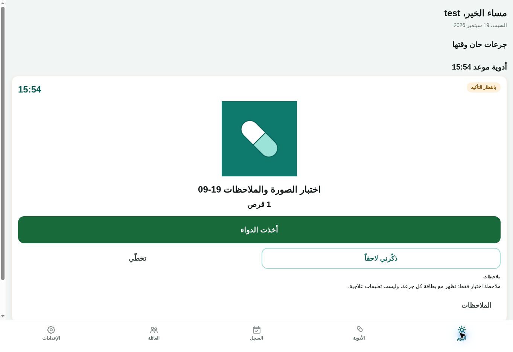
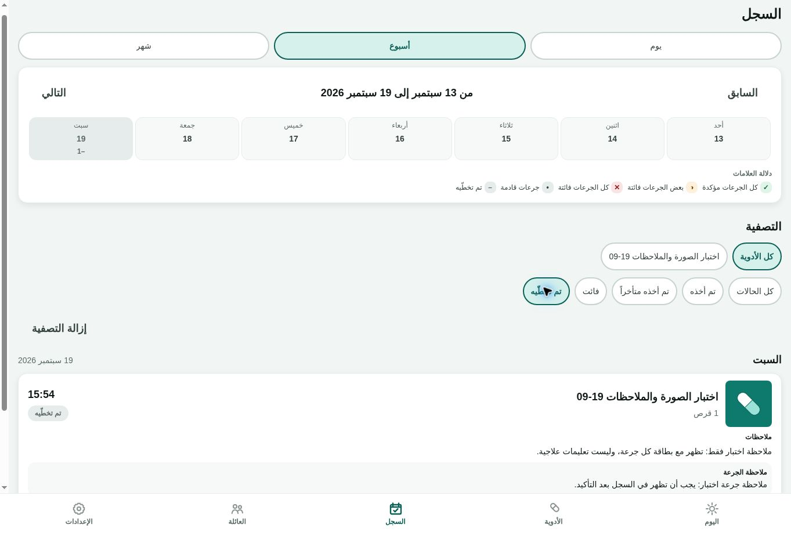

# Patient preview acceptance — 2026-09-19

This records real cloud-browser interaction, not an automated-test substitute.
The user completed authentication through the browser handoff. No credentials
were read, copied, generated, or inserted by the auditor. The display name was
`test`; no contact identifiers are included here.

## Candidate and environment

- Patient trials below used preview merge `cb7960bb06516d5d91b6c0c81c8492240373a788`,
  the exact `02748eb` candidate tree.
- The isolated preview uses mock push/OCR and ephemeral local image storage.
  These trials do not establish APNs delivery or production S3 persistence.
- The next auth-startup candidate `ae3805bf1688d3bbed4e4401fc496a096cbf910f`
  passed CI run **35444260866** and Security run **35444260865**. PostgreSQL 16
  and 17 each passed **2,801 tests / 370 files**, including 110 RLS attempts with
  zero unexplained failures or open findings. Mobile, dependencies, Docker and
  runtime recovery passed. Exact-tree preview merge `a205ef36dc3166151e73205df292391be1a1ead6`
  became live in deploy `dep-dan8gknavr4c73a6s6u0` at **13:06:41 UTC**.
- Production remains `63b5b8d`; TestFlight remains 0.1.0 (6). No final submission.

## Observed patient results

| Interaction | Observed result |
| --- | --- |
| Add medication through manual entry | Synthetic `اختبار الصورة والملاحظات 19-09` saved through the UI; POST /v1/medications returned 200 at 12:53:04 UTC. |
| Image upload | Uploaded the repository's own app icon as an explicitly synthetic recognition image; image appeared above due-dose confirmation controls and as a History thumbnail. |
| Schedule | Daily all seven days at 15:54 Asia/Riyadh, starting September 19; due card appeared. |
| Arabic number | Stock input `١٠` persisted and displayed as 10 tablets. |
| Medication note | Saved note appeared in medication detail, Today and History. It explicitly says it is test text, not treatment guidance. |
| Dose note | Saved `ملاحظة جرعة اختبار: يجب أن تظهر في السجل بعد التأكيد.`; the modal confirmed save and read it back with a timestamp. The exact note also appeared on Today, medication detail and History cards. |
| Taken | Dose left awaiting confirmation, appeared in today's record as taken; medication detail showed 9 tablets remaining. |
| Undo taken | Dose returned to awaiting confirmation; medication detail showed 10 tablets and no completed dose history. Dose note remained. |
| Custom snooze | Entered Arabic `١` minute and confirmed; Today and History displayed snoozed. No physical alert was expected/proven in mock preview. |
| Skip | Dose changed to skipped in Today and the independent History screen; note remained visible. |
| History filters | Taken filter excluded the skipped dose and showed the empty-filter result; skipped filter restored the correct card. Clear-filter and day/week/month navigation controls responded. Month displayed the skipped September 19 dose and upcoming daily doses. |
| Family | Empty care circle displayed correctly before the reload finding below. Full invitations/recipient acceptance remain pending. |

Evidence contains only synthetic test data:

## Reload finding and repair

After the new preview deployed, a direct navigation to `/family` ended the
memory-only web session as designed. The application nevertheless mounted its
tabs: Family claimed no followed patients, and Today showed a greeting with no
name or usable content. There was no sign-in/recovery transition. Navigating to
the canonical root did show language selection and sign-in.

`app/index.tsx` had a session/recovery gate, but the root Stack allowed direct
navigation to all private routes. `token-store.ts` intentionally does not
persist web tokens, so moving them into localStorage is not the repair.

The root now uses `AppNavigator` with Expo's existing `Stack.Protected` contract
for tabs, medication, reports, private caregiver/settings screens and reminder
landing. The first available destination is the existing index, preserving its
neutral retained-session recovery behavior. Auth, invitation capability/accept
and explicitly shared emergency-card routes remain public. The existing app
lock, email verification gate, server authorization and RLS remain in place.

The installed Expo Router 55 implementation and the official
[protected-routes documentation](https://docs.expo.dev/router/advanced/protected/)
were checked; no SDK 58-only `redirectTo` API is used.

Local verification: 40 focused tests passed (route inventory, clinical
auth/URL boundaries and auth screens), mobile TypeScript and changed-file
ESLint passed. The inventory test compares the navigator against actual route
files, so a new private route cannot silently fall outside the declared guard.
Deployed direct-URL acceptance subsequently **passed** on PR source `6dbf100`
through exact-tree preview merge `8459e3cc0d148e1133f723fbf6ef5aa633b27b31`,
deploy `dep-dan8lee8bjmc73ab1trg` live at **13:17:10 UTC**. Direct `/family`,
`/today` and `/settings` each resolved to `/language` without a session. Selecting
Arabic opened sign-in. The secure `browserAuth` request returned `submitted`;
fresh visible DOM then showed the synthetic patient's Today screen, saved
medication note and saved dose note. This is successful reauthentication on the
new deployed code, not an inference from submission alone.

## Invitation authoring and browser-control blocker

On deployed `6dbf100`, with the test patient authenticated:

- Empty invitation submission showed specific name and recipient validation.
- Observer preset selected schedule, adherence and notification permissions.
  Disabling schedule also disabled adherence; enabling adherence restored the
  required schedule permission. This was checked against rendered switches.
- Selected the nurse role and preset. It enabled medication/schedule/history/
  adherence/report access, dose confirmation, medication changes and stock;
  emergency-card access and caregiver administration stayed disabled.
- Created a **link-only synthetic nurse invitation** addressed to the reserved
  `example.test` domain. No SMS/email/share action to another person was sent.
  The result displayed "invitation created"; Copy link changed to "link copied".
  The private invitation bearer is not included in evidence or logs.
- Returned to Family and opened Manage permissions. It correctly said the
  invitation had not yet been accepted. Disabled dose confirmation, saved,
  observed the success banner, left and reopened the screen: the permission
  remained disabled. This verifies persistence, not recipient enforcement.
- Clicking Revoke access caused the cloud-browser control operation to time
  out while opening the browser confirmation. `getJsDialog`, a cancel-key
  attempt and a same-browser fresh-tab attempt also timed out during CDP tab
  refresh. **Revocation is not verified**; do not claim it succeeded or repeat
  a destructive action blindly. The synthetic invitation may remain pending.
  Manual browser recovery is required before further interface trials.

CI `35445151066` for `6dbf100` reported **2,782 passed / 22 failed** on both
PostgreSQL versions. Failures were limited to two test files: one app-lock
structural assertion still searched for the extracted `<Stack>` in the root
layout, and 21 push-listener harness cases lacked the new AppNavigator mock.
Mobile exports, Docker, dependencies, runtime recovery and Security passed.
The harness and structural assertion are updated without changing runtime
logic; the assertion now checks that the navigator is inside both boundaries
of AppLockGate and actually contains the Stack. New full CI is required.
After those harness updates, the complete local mobile/shared run passed
**1,134 tests in 159 files** (74.32 seconds); touched ESLint and diff checks
also passed. This does not replace the pending PostgreSQL-backed CI rerun.

The rerun on `cb4641c385cab9eddc511c72af1b2a8ed885a30f` subsequently completed:
CI **35446106156** and Security **35446106160** passed. PostgreSQL 16 and 17
each passed **2,804 tests in 371 files**; each RLS matrix recorded 110 attempts,
zero unexplained failures and zero open findings. Mobile, dependencies, Docker
and runtime recovery passed. This closes the test-harness regression only;
the remaining real-interface gates below are still open.

## Remaining acceptance gates

- Recover browser control after the confirmation dialog. Reauthenticate only
  if fresh visible evidence shows the session is gone; the preceding secure
  reauthentication already succeeded.
- Exercise public invitation entry and recovery paths, then resume the
  remaining patient controls. Direct private-URL redirection is verified above.
- Complete caregiver and nurse registration/verified identity, invitation
  acceptance, permission changes/revocation and patient-profile isolation in
  real interfaces.
- Complete actual email/phone login and recovery delivery, exports/print,
  image replacement/removal, remaining medication/settings controls.
- Complete physical iOS foreground/locked/offline notification, tap routing,
  photo/camera/share/app-lock trials on the audited build before final release.
