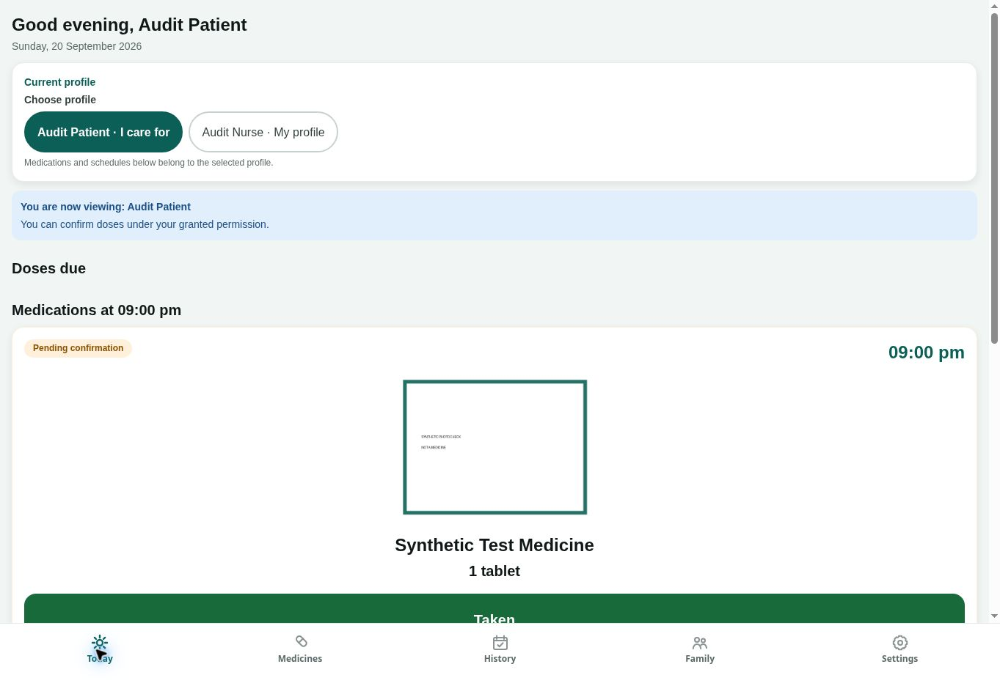

# صورة بطاقة تأكيد الجرعة — 20 سبتمبر 2026

## تجربة الواجهة

استخدمت التجربة جلستي المريض والممرض الاصطناعيتين القائمتين في معاينة
تداوي المستقلة. لم تُستخدم صورة وصفة أو دواء حقيقي أو معلومات مريض حقيقي.

1. من تفاصيل الدواء الاصطناعي، فُتح التعديل ثم «رفع صورة». نجح منتقي الملفات
   المدعوم مع ملف PNG اصطناعي مكتوب عليه `SYNTHETIC PHOTO CHECK` و
   `NOT A MEDICINE`. ظهر مصغره قبل الحفظ ثم الصورة المحفوظة في التفاصيل
   وبطاقة الجرعة الموجودة في سجل اليوم.
2. أضاف المريض موعد اختبار 21:00 إلى الجدول القائم 19:40. عرضت الواجهة
   الفرق واحتاجت تأكيداً منفصلاً؛ حُفظ التعديل وبقيت الجرعة المؤكدة سابقاً
   وملاحظتها ظاهرتين.
3. ظهر الموعد الجديد عند الممرض في «الجرعات المستحقة»، بالصورة فوق اسم
   الدواء والجرعة وأزرار «أخذت / ذكّرني لاحقاً / تخطي». ظهرت ملاحظة الدواء
   أيضاً. الصورة التالية توثق البطاقة قبل التأكيد.
4. أكد الممرض الجرعة الاصطناعية؛ انتقلت إلى سجل اليوم مع الصورة، وظهرت
   النتيجة عند المريض بعد المزامنة. لم تبق الجرعة «بانتظار التأكيد».

## حدود الدليل

- هذا دليل متصفح سحابي بعرض مكتبي، وليس تطبيق iPhone أصلياً أو تصويراً
  بالكاميرا أو اختبار OCR. كان الخادم على `e954178` والمخطط 0095؛ الجلستان
  مفتوحتان من قبل إعادة نشر إصلاح السحب، ومسارات الصور والتأكيد لم تتغير
  بين النسخة التي حملتاها ومرشح البناء 10.
- حُل عائق منتقي الملفات السابق باستخدام مسار الرفع الموثق والمجلد المشترك،
  فلا يبقى رفع الصورة وعرضها في بطاقة التأكيد بلا تجربة ويب.
- لم يُختبر حذف الصورة أو عرضها على جهاز أصلي، ولا تعني التجربة اكتمال
  مصفوفة كل الأدوار والأزرار أو إعادة اختبار مهلة سحب التفويض.
- في إعدادات الخصوصية ظهرت مهلة الحذف 14 يوماً وخطوة تأكيد منفصلة، وعمل
  زر الإلغاء. لم يُرسل طلب حذف حساب، ولا يُنسب لهذه الزيارة إثبات إبطال
  جلساته. إعدادات الإشعارات صرحت بأن إشعارات النظام غير متاحة في المتصفح؛
  ما زال وصول إشعار الجهاز والجدولة أثناء قفل الهاتف بحاجة لتجربة أصلية.
